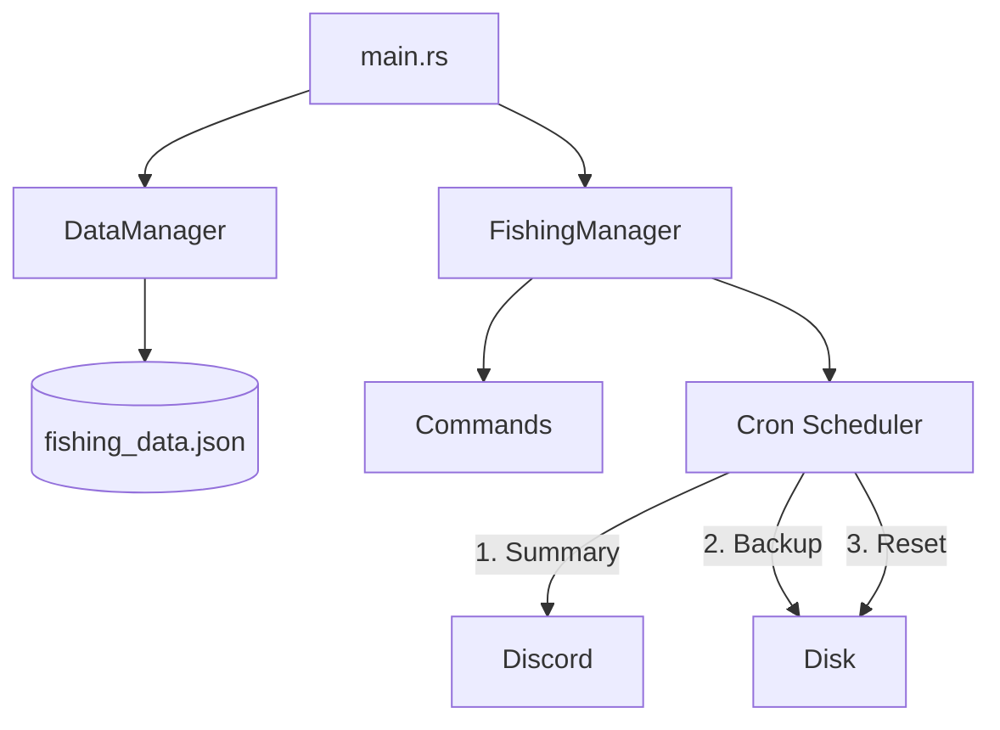

# 🐠 Stardust Pond: High-Performance Discord Fishing

[](https://www.rust-lang.org/)
[](https://github.com/serenity-rs/serenity)
[](https://opensource.org/licenses/MIT)

**Stardust Pond** is a production-grade Discord bot designed to drive community engagement through a daily fishing minigame. Originally a Node.js application, this complete Rust rewrite offers extreme performance, 100% thread safety, and "rock-solid" uptime.

---

## 🌟 What the Bot Does

Stardust Pond is an engagement engine. It encourages members to visit your server daily by providing a reward-based fishing minigame. 

### 🎮 Player Features
*   **The "Fish!" Button**: A simple, interactive UI for one-click fishing.
*   **Streak Tracking**: Consistency is rewarded! Users build daily streaks that reset if they miss a day.
*   **Persistent Stats**: Tracks total lifetime catches and server-wide daily totals.
*   **Leaderboards**: Showcases the "Best Anglers" to drive competition.

### 🛡️ Administrative Utility
*   **Automated Reminders**: Scans your server daily and pings inactive members (customizable threshold).
*   **Privacy-First Commands**: Administrative commands and summaries are ephemeral (visible only to you).
*   **Cron Scheduling**: Precise, calendar-based resets (Summary -> Backup -> Reset).

---

## 🛠 Prerequisites

*   **Rust Stable** (Install via [rustup.rs](https://rustup.rs/))
*   **Discord Bot Token** with `GUILD_MEMBERS` intent enabled in the Developer Portal.

## 🚀 Quick Start

1.  **Clone the Repository**
    ```bash
    git clone https://github.com/your-repo/stardust-pond.git
    cd stardust-pond
    ```

2.  **Configure Environment**
    Create a `.env` file in the root directory:
    ```env
    DISCORD_BOT_TOKEN=your_secure_token_here
    ```

3.  **Deploy**
    ```bash
    # Run in development mode
    cargo run

    # Compile for production
    cargo build --release
    ```

---

## 🎮 Commands Overview

### 👤 For Users
| Command | Description |
| :--- | :--- |
| `/fish` | Cast your line! (Once per calendar-day window). |
| `/summary` | Triggers a live update of today's pond statistics. |

### 🔑 For Admins
| Command | Usage |
| :--- | :--- |
| `/fishsetup` | Spawns the permanent **Fishing Dashboard** (Button UI). |
| `/fishsummary` | Shows a private list of members who haven't fished today. |
| `/setrole` | Tracks a specific role for reminders and stats. |
| `/setsummarychannel` | Sets the target channel for automated nighty reports. |
| `/settogglereminder` | Toggles between `@ping` mode or `Nickname` mode. |

---

## 🧠 Technical Deep Dive (What You Can Learn)

This project serves as an excellent example of **Async Rust** and **Concurrency Safety**. If you are learning Rust, here are the key architectural patterns used:

### 1. Atomic State Management
Instead of simple variables, we use `Arc<RwLock<T>>` for the database and `Arc<AtomicBool>` for process flags.
*   **Learning Point**: This ensures that even if 100 users click "Fish!" at the exact same millisecond, the bot handles them sequentially without data races or crashes.

### 2. The RAII Guard Pattern (Safety First)
We use a custom `ResetGuard` struct for the daily reset process. 
*   **Learning Point**: This ensures that even if the bot panics or an error occurs, the `is_resetting` flag is **always** reset to false when the guard goes out of scope.

### 3. Atomic File I/O
Database saves do not write directly to `fishing_data.json`. Instead, they write to a `.tmp` file and then use the `rename()` syscall.
*   **Learning Point**: This provides "All-or-Nothing" writes. If your computer crashes mid-save, the old data remains safe and uncorrupted.

### 4. Member Pagination
Discord limits member fetching to 1000 per request. This bot implements an asynchronous paging loop.
*   **Learning Point**: This allows the bot to scale to servers with **100,000+ members** without hitting memory limits or missing users.

---

## 📂 Project Architecture



---

## 📝 License

Distributed under the MIT License. See `LICENSE` for more information.

---
*Built with ❤️ for the Stardust Pond, by nightmare family.*